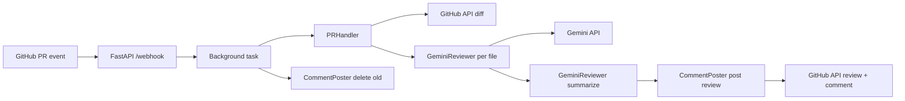

# AI Code Review Bot

Open-source Gemini-powered GitHub bot that reviews PR diffs, posts inline fix suggestions, and summarizes risk. A FastAPI webhook receives pull request events, fetches and filters the diff, reviews each file with Google Gemini, and posts inline comments plus a PR-level summary. Background tasks keep webhook responses fast; signed payloads and comment cleanup on re-push keep reviews reliable.

## Screenshots

Add screenshots of inline review comments and the PR summary under `docs/screenshots/` and link them here.

## What it does

1. **Receive** — GitHub sends a `pull_request` webhook (`opened` or `synchronize`) to `POST /webhook`. The handler verifies the HMAC signature and queues a background review.
2. **Fetch** — `PRHandler` loads the PR diff via the GitHub API, keeps supported source files, and skips ignored paths, unsupported extensions, and oversized patches.
3. **Clean** — `CommentPoster` removes previous comments from the bot user so re-pushes do not clutter the PR.
4. **Review** — `GeminiReviewer` sends each file patch to Gemini and parses structured JSON issues (line, severity, category, comment, suggestion) with retries and backoff.
5. **Summarize** — A second Gemini call merges all issues into a PR summary with risk level (`low` / `medium` / `high`), counts by severity, and good practices noted.
6. **Post** — The bot submits a GitHub PR review with inline comments and a top-level summary comment. `/stats` tracks totals in memory; `/health` reports API key presence.

The webhook responds immediately with `{"status": "review queued"}` while the pipeline runs asynchronously.

## Architecture



| Component | Role |
|-----------|------|
| `webhook/server.py` | FastAPI app, signature verification, background dispatch, `/health`, `/stats` |
| `github_client/pr_handler.py` | Fetch PR diff, filter files, in-memory diff cache |
| `reviewer/gemini_reviewer.py` | Per-file review and PR summary via Gemini |
| `reviewer/comment_poster.py` | Delete prior bot comments, post review and summary |
| `tests/test_reviewer.py` | Unit tests for reviewer, handler, and webhook |

## Tech stack

- Python 3.12.10
- FastAPI + Uvicorn (HTTP server and webhooks)
- PyGithub (pull requests, diffs, reviews, comments)
- `google-generativeai` (Gemini `gemini-3.5-flash` for file review and summarization)
- `python-dotenv` (local configuration)
- Docker (containerized deploy)
- GitHub Actions (pytest on pull requests)
- Render (hosted deployment)

## Prerequisites

- Python 3.12.10 or compatible 3.12.x
- API keys: [Google AI Studio](https://aistudio.google.com/) (Gemini), GitHub personal access token with `repo` scope (or fine-grained PR/repo permissions)
- A publicly reachable HTTPS URL for the webhook (local dev: use [ngrok](https://ngrok.com/) or similar)
- Render account (or any host with a public HTTPS URL)

## Setup

```bash
git clone https://github.com/Arnav-Tyagii/ai-code-review-bot.git
cd ai-code-review-bot
python -m venv .venv
```

**Windows**

```bash
.venv\Scripts\activate
```

**macOS / Linux**

```bash
source .venv/bin/activate
```

```bash
pip install -r requirements.txt
cp .env.example .env
```

Edit `.env` and set your keys:

| Variable | Required | Description |
|----------|----------|-------------|
| `GEMINI_API_KEY` | Yes | Gemini API key from Google AI Studio |
| `GITHUB_TOKEN` | Yes | GitHub token for the bot account (needs PR read/write) |
| `GITHUB_WEBHOOK_SECRET` | Yes | Shared secret for `X-Hub-Signature-256` verification |

Create a GitHub webhook on the target repository:

- **Payload URL:** `https://<your-host>/webhook`
- **Content type:** `application/json`
- **Secret:** same value as `GITHUB_WEBHOOK_SECRET`
- **Events:** Pull requests only

## Run

**Local**

```bash
uvicorn webhook.server:app --reload --host 0.0.0.0 --port 8000
```

Open `http://localhost:8000/health` to confirm Gemini and GitHub keys are loaded. Point your GitHub webhook (or ngrok URL) at `http://<public-host>/webhook`, then open or update a pull request to trigger a review.

**Docker**

```bash
docker build -t ai-code-review-bot .
docker run -p 8000:8000 --env-file .env ai-code-review-bot
```

## Configuration

Behaviour is controlled by constants in the source modules:

| Constant | Location | Default | Purpose |
|----------|----------|---------|---------|
| `ALLOWED_EXTENSIONS` | `github_client/pr_handler.py` | `.py`, `.js`, `.ts`, `.java`, `.cpp`, `.go` | File types sent to Gemini |
| `IGNORED_DIRS` | `github_client/pr_handler.py` | `node_modules/`, `.git/`, `dist/`, `build/`, `__pycache__/` | Paths excluded from review |
| `MAX_DIFF_LINES` | `github_client/pr_handler.py` | `500` | Skip files with more than this many changed lines |
| Gemini model | `reviewer/gemini_reviewer.py` | `gemini-3.5-flash` | Model for per-file review and PR summary |
| Max issues per file | `reviewer/gemini_reviewer.py` (prompt) | `8` | Upper bound on inline comments per file |
| Review retries | `reviewer/gemini_reviewer.py` | `3` | Retries with exponential backoff on API errors |

Issue `severity` values: `critical`, `warning`, `suggestion`. Categories include `bug`, `security`, `oop_violation`, `style`, `performance`, `best_practice`.

## Deploy (Render)

1. Create a **Web Service** on [Render](https://render.com/) and connect this GitHub repo.
2. Use **Python** (recommended) or Docker. For Python, set:
   - **Build command:** `pip install -r requirements.txt`
   - **Start command:** `uvicorn webhook.server:app --host 0.0.0.0 --port $PORT`
   - **Health check path:** `/health`
3. Add environment variables in the Render dashboard (same as `.env`):

| Variable | Required |
|----------|----------|
| `GEMINI_API_KEY` | Yes |
| `GITHUB_TOKEN` | Yes |
| `GITHUB_WEBHOOK_SECRET` | Yes |

4. After deploy, open `https://<your-service>.onrender.com/health` and confirm both keys show as connected.
5. In GitHub repo **Settings → Webhooks**, set **Payload URL** to:

   `https://<your-service>.onrender.com/webhook`

Render redeploys automatically when you push to the connected branch. You can also use the included `render.yaml` as a Blueprint.

**Note:** The old Railway GitHub Action was removed so pushes to `main` no longer show a failed deploy check. CI tests still run on pull requests only.

## API endpoints

| Method | Path | Description |
|--------|------|-------------|
| `GET` | `/` | Service info |
| `GET` | `/health` | Status, version, key presence |
| `GET` | `/stats` | In-memory review counters |
| `POST` | `/webhook` | GitHub pull request webhook |

## Project layout

```
ai-code-review-bot/
├── webhook/
│   └── server.py              # FastAPI app and review pipeline
├── github_client/
│   └── pr_handler.py          # Diff fetch, filter, cache
├── reviewer/
│   ├── gemini_reviewer.py     # Gemini review and summarization
│   └── comment_poster.py      # GitHub review and comments
├── tests/
│   └── test_reviewer.py       # Pytest suite
├── .github/workflows/
│   └── test.yml               # PR tests
├── render.yaml                # Render Blueprint (optional)
├── Dockerfile
├── requirements.txt
├── .env.example
└── README.md
```

## Observability

- Application logs use Python `logging` (request method, path, status, latency via middleware; pipeline steps at INFO/ERROR).
- `GET /health` reports whether `GEMINI_API_KEY` and `GITHUB_TOKEN` are set.
- `GET /stats` returns `total_prs_reviewed`, `total_issues_found`, and `total_critical_issues` (in-memory; resets on process restart).

## Tests

```bash
pytest tests/ -v
```

CI runs the same command on pull requests to `main` (see `.github/workflows/test.yml`).

## Repository

https://github.com/Arnav-Tyagii/ai-code-review-bot

## Notes

- `.env` is gitignored; never commit API keys or tokens.
- Diff cache and stats live in process memory and do not persist across restarts or multiple Uvicorn workers.
- Only `pull_request` events with action `opened` or `synchronize` trigger a review.
- If inline comment line numbers do not match the diff, the poster falls back to a review without inline comments.
- The Docker image runs Uvicorn with two workers; for a single shared stats/cache instance, use one worker or an external store.
